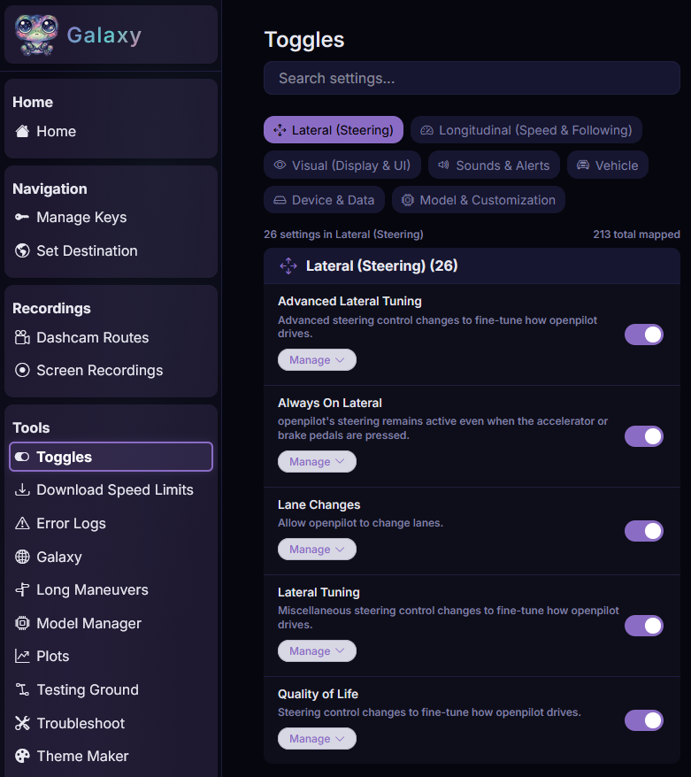

# Galaxy

Galaxy is StarPilot's web UI for configuring settings, debugging, and viewing recordings. 
It can be used from your phone on the same local network or remotely.
It is free and will remain free for as long as possible.

## Pairing

Pairing must be completed once. 
Your device will remain paired until unpaired.

1. On your comma device, open Settings > Device > Galaxy (Pair).
2. Enter your desired passcode.
3. Scan the QR code that appears. Save this URL to access the galaxy in the future.

## Unpairing

1. On your comma device, open Settings > Device > Galaxy (Unpair).
2. Your device should now be unpaired.

## Features

The most notable features include:

1. Toggles: You can change settings from your couch instead of being restricted to your device. 
Settings are also searchable.
2. Model Manager: Choose your desired model.
3. Troubleshoot: Check which settings are non-default and might be causing you issues.
4. Error Logs and Tmux Log: To help us debug if you run into issues.
5. Plots: Visualize what the model is trying to do or if your car isn't listening (bad tuning)
6. Testing Ground: Test firestar's newest experimental tunes, designed to improve your comma's performance.
