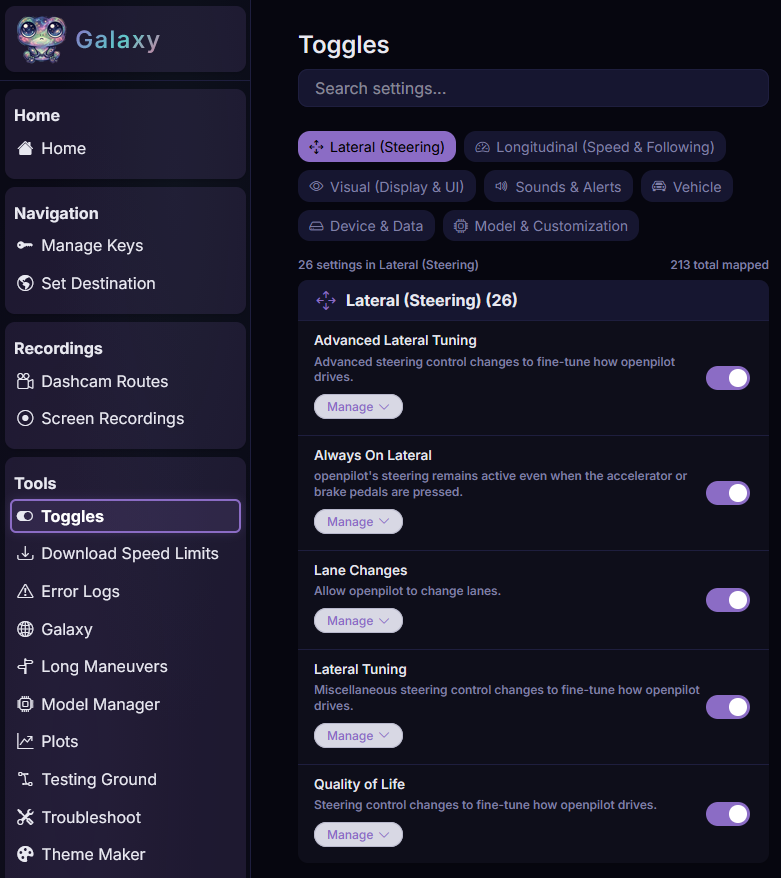

# Galaxy

Galaxy is StarPilot's web UI for configuring settings, debugging, and viewing recordings. 
It can be used from your phone on the same local network or remotely.
It is free and will remain free for as long as possible.

## Pairing

Once your device is paired, your device will remain paired until unpaired.

1. On your comma device, open Settings > Device > Galaxy (Pair).
2. Enter your desired passcode.
3. Scan the QR code that appears. Save this URL to access the galaxy in the future.

> [!IMPORTANT] Save the URL from the QR code
> The QR code's URL is unique to your device. Save it for future use.
> It will also change if you re-pair.

> [!IMPORTANT] Be patient when first pairing.
> It may take few minutes for the tunnel between your device and the galaxy server to establish.

> [!TIP] Multiple Comma Devices
> If you have multiple comma devices and you want to switch between them, 
> bookmark the auth URLs for each one (the URL that results from scanning the QR code).
> Open the URL of the desired comma each time you need to switch.

## Unpairing

1. On your comma device, open Settings > Device > Galaxy (Unpair).
2. Your device should now be unpaired.

## Features

The most notable features include:

1. Home Page: View drive statistics.
1. Toggles: You can change settings from your couch instead of being restricted to your device. 
Settings are also searchable.
1. Model Manager: Choose your desired model.
1. Lateral Tuning: Use the Firestar Lateral Method (FLM) to tune your vehicle's lateral behavior.
1. Troubleshoot: Check which settings are non-default and might be causing you issues.
1. Navigation: Use navigation hints to help with highway exits and turn desires.
1. Error Logs and Tmux Log: To help us debug if you run into issues.
1. Plots: Visualize what the model is trying to do or if your car isn't listening (bad tuning)
1. Testing Ground: Test firestar's newest experimental tunes, designed to improve your comma's performance.
