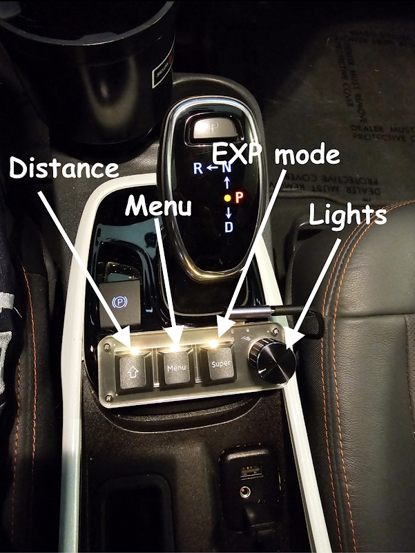

# Configure Settings

Most settings aim to have a good default value.
To learn more about any setting, tap the title to see a description.
These settings will generally persist across branches and forks unless you wipe/reset.

> [!TIP] TL;DR?
> Just look for all the ==blue highlights== - 
> they will tell you any settings you need to turn off or on for best experience.

> [!WARNING] Make Sure your Fingerprint is Correct
> If you ignore the rest of our suggestions here, at the very least, make sure you 
> [set your correct fingerprint](#vehicle-controls) to avoid issues.

## Openpilot Toggles

This is the upstream openpilot settings window.

* Openpilot: ==Enabled==
* Openpilot Longitudinal Control (Alpha): ==Enabled==
    * *If this toggle is not present for you, ignore.*
    * If you want to use stock ACC, disable. 
You will lose all openpilot long control 
(eg. stop sign and traffic light stopping, Curve Speed Control, Speed Limit Control)
* Experimental Mode: ==Disabled==
    * Frogpilot/Starpilot use Conditional Experimental Mode (CEM) 
instead to switch into experimental when it makes sense to (eg. traffic lights).

## FrogPilot Settings

The rest of the settings below are in the FrogPilot section of settings.

## Tuning Level

There are multiple tuning levels in the FrogPilot settings - these will enable or disable more advanced tuning parameters.

For best results on StarPilot, you’ll need to ==use the **Advanced** tuning level==.

## Alerts and Sounds

These are optional changes. Some popular changes include:

* Under **Alert Volume Control**, you can adjust or mute the disengage and engage sounds. We DON’T recommend changing the volume of any important alerts.
* Under **FrogPilot Alerts**, you can enable the Green Light Alert and Lead Departing Alert to get gentle nudges when a traffic light has turned green or the car in front of you has started moving.

## Driving Controls

### Driving Model

* Automatically download and update models: ==Turn On==

#### Model Selection

See [the driving model guide](./driving-model.md).

### Gas / Brake

#### Conditional Experimental Mode: ==Turn On==

These settings control Conditional Experimental Mode, often called "CEM". Experimental Mode (vs "Chill Mode") is not yet good enough to handle all driving. But it can handle traffic lights & stop signs, and is better in some situations. So we automatically enable it in certain conditions where it is better than Chill.

Experimental Mode has a tendency to slow down/speed up weirdly, and overall just behave strangely, so we recommend conditionally enabling it only when necessary.

* **Curve Detected Ahead:** Turn off and instead rely on the "Curve Speed Controller" 
* **Lead Detected Ahead:** ==Turn on both Slower Lead and Stopped Lead==, to help the model better slow when using VOACC (Visual Only ACC).
* **Navigation Data:** Recommend leaving off.
* **openpilot Wants to Stop In:** Helps with slowing to a stop at lights, in traffic, etc. ==Default is 8 seconds==. Increase this number if your car is not slowing down in time for leads/lights. Decrease this number if you're getting lots of false activations and the car is going in and out of CEM when it shouldn't.
* **Status Widget:** Up to you. Recommend leaving on. Shows an icon that displays if CEM is active, and if so, why.

#### Curve Speed Control: ==Turn On==

The new Curve Speed Controller from upstream FrogPilot now learns how fast you like to take certain curves at different speeds. When approaching a curve, you will see an icon appear in the top left of the screen notifying you that the smart curve controller is "training." It will adapt to your preferences over time. This training will take place regardless of openpilot engagement.

#### Customize Driving Personalities: Personal Preference

Allows you to enable or disable certain personalities.

Manage lets you set the follow distance to your preference.

These have been tuned by firestar - if you wish to tune how they react, you can unlock additional settings by switching to the *developer* tuning level. Be careful though!

See [Appearance -> Driving Screen Widgets](#appearance) to enable an on screen button for switching personalities.

Optional: [A macropad accessory](https://github.com/nelsonjchen/c3-faux-touch-keyboard) is available to adjust driving personality without touching the screen. It costs around $25 and requires minor tinkering.

{ width="300" }

#### Longitudinal Tuning: ==Turn On==

* **Acceleration Profile:** ==Sport==
* **Deceleration Profile:** ==Eco==

The above profiles have been specially tuned to work better with the Bolt's accel & decel curve.

* **Taco Bell Run:** Just leave taco bell run stuff off.

!!! warning "Always Turn Off Human Like Acceleration/Following as they interfere with the StarPilot VoACC tuning"

    Human Like Accel and Leads should always be turned off. Recent tuning improvements have made these settings act erratically.

#### Quality of Life: ==Turn On==

* **Cruise Intervals:** These are up to you! I'm not sure the "long press" works on all vehicles. Some like to increase short press to 5mph for easier jumps in cruise speed.
* **Force Keep openpilot in the Standstill State:** When this toggle is on, openpilot will require user input before it will resuem from a fully stopped state.
* **Force Stop for "Detected" Stop Lights/Signs:** ==Recommend Turning On.== This will help prevent (but not eliminate!) the Comma from running red lights or stop signs.

!!! warning "Stop Light and Stop Sign Detection can be Inconsistent"

    You should always be extremely alert and ready to take manual control at stop lights and stop signs. Every model is different, and although red light and stopped lead detection is getting very good, stop sign detection is still quite bad. Additionally, our reliance on regen-braking only in the Bolt means that openpilot will often not have enough stopping power to stop in time once it has detected a stopped lead or traffic light.

* **Increase Stopped Distance:** Only applies when coming to a complete stop. If your car is regularly stopping too late when coming to a complete stop, increase this number to your preference. This will not help in cases where openpilot did not start slowing in time. See "openpilot Wants to Stop In" in the [CEM](../usage/settings.md#conditional-experimental-mode-turn-on) settings for help with this.

* **Map Accel/Decel to Gears:** Allows sport mode to increase to the next accel profile. Recommended to keep **off** as sport mode changes the lateral response for gen2 cars (gives them less torque).

### Steering

#### Advanced Lateral Tuning: Leave Off

Section is WIP, features here are more for special cases & testing.

#### Always on Lateral: ==Recommend Turning On==

Always on Lateral, also known as AoL (or mads in sunnypilot) allows you to turn on just the steering control (lateral) without the pedal control (longitudinal). This can be quite nice & useful, so we generally recommend having it on.

With this on & the default settings, the cruise control main button (the one that turns all of cruise control on or off) will enable/disable Lateral control. Then, with cc main (and therefore AoL) on, hitting set or resume will enable longitudinal control. Cancelling with paddle or brake will keep AoL enabled but turn off longitudinal control.

!!! warning "Does not work under 6mph"

    The Bolt does not allow for lateral control under 6mph. This applies to AoL and standard modes. It will not steer for you under 6mph.

#### Lane Changes: ==Turn On==

* **Automatic Lane Changes:** ==Turn Off==. With this off, you have to nudge the steering wheel before it changes lanes. This is ideal, since it lets you signal to other cars that you are changing lanes without actually starting the lane change.
    * Due to a quirk with steering torque, human-initiated lane changes will also be smoother and more natural.

!!! warning "Stay Aware while Changing Lanes"

    The Comma won't change lanes if it detects a car in your blind spot, but you should ALWAYS check first. Neither your Bolt's blind spot monitors nor the Comma have 360 degree awareness.

* **One Lane Change Per Signal** ==Turn On== just to be safe.

The remaining settings can be left at default.

#### Lateral Tuning: ==Turn On==

* **Force Turn Desires:** Leave off
* **Smooth Curve Handling:** Leave off. It seems to interfere with the new comma torque controller. If the logic is updated at a later date, we will update here.

If NNFF appears here, disable it. Upstream NNFF doesn't play well with the different gens of Bolt.

#### Quality of Life Improvements: Optional

## Navigation

Ignore Navigation. It's not supported very well by Comma and it's a pain to set up. It's not able to, say, drive you to your destination without your intervention. Just use your preferred mapping app via CarPlay/Android Auto.

## System Management

Optional. Provides options for adjusting the screen brightness and other device settings.

## Theme and Appearance

### Appearance

* **Advanced UI Controls:** Optionally enable
    * Some prefer to hide Current Speed and Lead Marker for a cleaner look. I like leaving them on. Lead marker can be useful when testing new models. All personal preference.

* **Developer UI**: Leave off, unless you have a specific reason to turn this on. Gives stats and things that are useful for troubleshooting & development purposes, but not useful for day-to-day driving.

* **Driving Screen Widgets**: ==Turn On==
    * Enabling Acceleration Path, Blind Spot Path, and Rotating Steering Wheel can be nice, but is optional
    * **Driving Personality Button:** ==Turn On for Gen 0 and Gen 1.== In StarPilot, the driving personalities mostly handle follow distance. Gen 2 is able to control this using the steering wheel button. Gen 0 and Gen 1 need to use the on screen button for this.
    * All other options are optional.

* **Navigation Widgets:** Optional

* **Quality of Life:** Optional
    * Can adjust camera views, standby mode, and other optional settings

### Theme

If you prefer a more *professional* look, you can disable all toggles here and set the startup alert to stock.

The frogpilot startup alert & various frog themed things can sometimes be concerning to passengers who have not encountered the Comma before.

* **Custom Theme**: ==Optionally disable frog noises.== Although I'm personally generally fine with the more fun frog-themed stuff, I do always change the sound pack to default to disable the frog noises on activation/deactivation, as I find them to be a bit much.

## Vehicle Controls

### Vehicle Settings

* ==Select your car model==
* Disable Automatic Fingerprint Detection: ==Enabled==
* Disable openpilot Longitudinal Control: ==Disabled==
    * *If this toggle is not present for you, ignore.*

> [!NOTE] Fingerprinting Info
> Fingerprinting is inconsistent on GM vehicles. 
> As such, sometimes ACC bolts decide to fingerprint as Non-ACC which causes fun issues 
> such as… not having Gas/Brake. 
> So to be sure, it’s just always best to manually fingerprint by disabling auto fingerprint.

### General Motors Settings

* FrogsGoMoo’s experimental longitudinal tune: ==Disabled==
* Smooth Pedal Response on Hills: ==Enabled==
