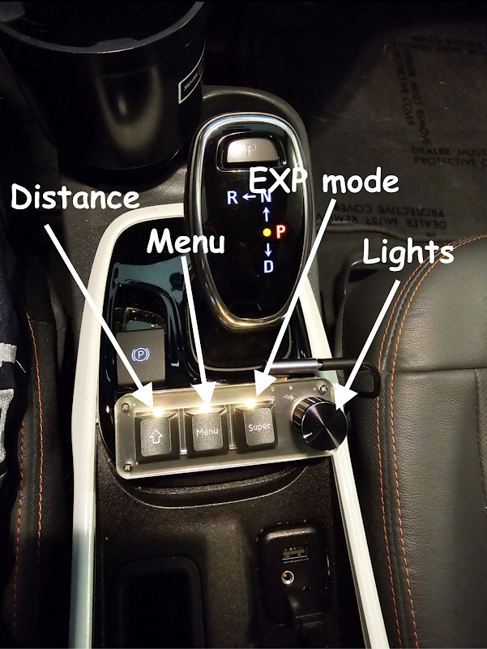

# Configure Settings

The default settings are good for most users and are recommended.
These settings will generally persist across branches and forks unless you wipe/reset.

The below sections highlight settings that might be worth looking at.
If you have trouble finding any settings, use [Galaxy](./galaxy.md)'s toggle search.

If behavior feels off or the car drives unexpectedly, 
try resetting your toggles to default or using safe mode.

> [!WARNING] Golden Safety Rule
> If you're going to change a value, change it by no more than 10% at a time.

> [!TIP] Want to change settings from your phone?
> Use [the Galaxy](./galaxy.md)

## StarPilot Essential Settings

> [!WARNING] Do not skip these settings

* [If in a GM vehicle, set your correct vehicle fingerprint](#vehicle-controls)

> [!NOTE] Fingerprinting Info
> Fingerprinting is inconsistent on GM vehicles. 
> As such, sometimes ACC bolts decide to fingerprint as Non-ACC which causes fun issues 
> such as… not having Gas/Brake. 
> So to be sure, it’s just always best to manually fingerprint 
> by disabling auto fingerprint and manually selecting your make/model.

## Safe Mode

> [!TIP] Use safe mode to temporarily force all tuning settings to default
> This allows you to see if a setting is possibly causing bad car behavior.

## Openpilot Toggles

This is the upstream openpilot settings window. Every other section is custom.

* Openpilot: ==Enabled==
* Openpilot Longitudinal Control (Alpha): ==Enabled==
    * *If this toggle is not present for you, ignore.*  
    * If you want to use stock ACC, disable. 
You will lose all openpilot long control 
(eg. stop sign and traffic light stopping, Curve Speed Control, Speed Limit Control)

## Alerts and Sounds

* **Alert Volume Control**
    * You can adjust or mute the disengage and engage sounds.
    * We do not recommend changing the volume of any important alerts.
* Green Light Alert 
* Lead Departing Alert

## Driving Controls

### Gas / Brake

#### Conditional Experimental Mode: ==Recommended==

Read more about CEM [in the operation guide](./operation.md#conditional-experimental-mode)

* **Curve Detected Ahead**: Turn off 
    * Use the [Curve Speed Controller](./operation.md#curve-speed-controller) instead
* **Lead Detected Ahead**: 
    * Slower Lead: ==Turn On== if your car has no radar (eg. Bolts)
    * Stopped Lead: ==Turn On== if your car has no radar (eg. Bolts)
* **Navigation Data**: Turn off
* **openpilot Wants to Stop In**: ==7 seconds== 
    * Helps with slowing to a stop at lights, in traffic, etc. ==Default is 7 seconds==. 
    * Increase this number if your car is not slowing down in time for leads/lights. 
    * Decrease this number if you're getting lots of false activations 
and the car is entering or exiting CEM unexpectedly.
* **Status Widget**: ==Recommended: On==. 
    * Shows an icon that displays if CEM is active, and if so, why.

#### Conditional Chill Mode

The inverse of CEM: instead of switching *into* experimental mode for tricky scenes, 
it keeps experimental mode on by default and drops back to chill mode in simple cruising. 
Read more about CCM [in the operation guide](./operation.md#conditional-chill-mode).

> [!INFO] Mutually exclusive with CEM
> CCM and [CEM](#conditional-experimental-mode-turn-on) cannot both be active. 
> If both are enabled, CEM takes precedence.

#### Curve Speed Control

Read more about CSC [in the operation guide](./operation.md#curve-speed-controller)

#### Customize Driving Personalities

Enabling allows you to customize personalities to your preference.

See [Appearance -> Driving Screen Widgets](#appearance) 
to enable an on-screen button for switching personalities. 
This is helpful for cars without a following distance button.

Optional: [A macropad accessory](https://github.com/nelsonjchen/c3-faux-touch-keyboard) 
is available to adjust driving personality without touching the screen. 
It costs around $25 and requires minor tinkering.

{ width="300" }

#### Quality of Life

* **Reverse Cruise Increase**
    * Short press of CC + will increase speed by 5 mph/kph and long press will increase by 1
* **Increase Stopped Distance**: 
    * Only applies when coming to a complete stop. 
If your car is regularly stopping too late when coming to a complete stop behind another vehicle, 
increase this number to your preference. 
This will not help in cases where openpilot did not start slowing in time. 
See "openpilot Wants to Stop In" in the [CEM](#conditional-experimental-mode-turn-on) 
settings for help with this.

### Steering

#### Always on Lateral

Read more about AoL [in the operation guide](./operation.md#always-on-lateral)

#### Lane Changes

* **Automatic Lane Changes:** ==Recommended Off==. 
    * With this off, you have to nudge the steering wheel before it changes lanes. 
This is ideal, since it lets you signal to other cars that you are changing lanes 
without actually starting the lane change.
    * Due to a quirk with steering torque, 
nudge-initiated lane changes will also be smoother and more natural.

> [!WARNING] Stay Aware while Changing Lanes
> The Comma won't change lanes if it detects a car in your blind spot, 
> but you should ALWAYS check first. 
> Your blind spot monitors cannot see everything.

#### Lateral Tuning

> [!WARNING] Custom Torque Controller
> We use a custom torque controller that generally works better than upstream for more vehicles.
> For that controller to work, BOTH Smooth Curve Handling and NNFF must be off.
> If either are on, it reverts to an older version of the torque controller.
> This might be better for certain cars with good NNFF tunes (like the Volt),
> but we recommend leaving both off for now.

* **Force Turn Desires**: Leave off
* **Smooth Curve Handling**: Leave off.
    * Also known as NNFFLite.
    * If this is on, the old torque controller will be used.
* **NNFF**: Neural Network Feed Forward
    * Can be smoother but can also lack peak torque.
    * Do not use with Bolts.

#### Quality of Life Improvements: Optional

## Navigation

StarPilot can inject turn desires into any driving model to assist through turns and exits.
Set a destination from [the Galaxy](./galaxy.md) to use it.
See [the operation guide](./operation.md#navigation) for what to expect — 
it is a driving aid, not point-to-point autonomy.

> [!IMPORTANT] Required setup for navigation
> Navigation will not do anything until these are set:
>
> * **Add a Mapbox key.** A Mapbox API key is required for navigation/maps to work.
> * **Enable Use Route Desires.** Under **Toggles -> Lateral -> Lateral Tuning**, 
> turn on **Use Route Desires**. This is what injects turn desires into the model 
> (the steering side of navigation).
> * **Enable Use Route Speed Control.** Under **Toggles -> Longitudinal -> Longitudinal Tuning**, 
> turn on **Use Route Speed Control**. This is what slows the vehicle down for upcoming turns 
> (the longitudinal side of navigation).
